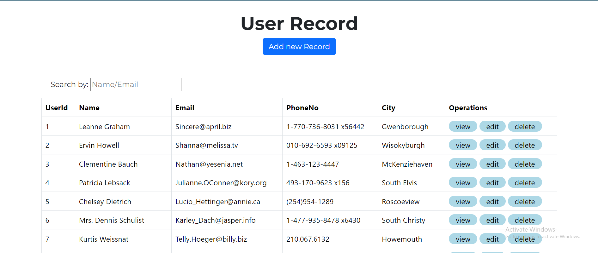

# User Records Management Application

This is a simple web application for managing user records. It allows users to view, add, edit, and delete user records stored in a local data table. The application is built using HTML, CSS, JavaScript, AngularJS, and Bootstrap.

## Features

- View a list of user records with details such as ID, name, email, phone number, and city.
- Add new user records to the data table.
- Edit existing user records.
- Delete user records from the data table.
- Search for user records by name or email.

## Preview

 (search.png) (view.png)
 
## Getting Started

To get a local copy up and running follow these simple steps.

### Prerequisites

- Web browser (Google Chrome, Mozilla Firefox, etc.)
- Internet connection (for loading Bootstrap and AngularJS from CDNs)

### Installation

1. Clone the repository
   ```sh
   git clone https://github.com/your_username/your_repository.git
   ```
2. Open the `index.html` file in a web browser.

## Usage

1. Open the application in a web browser.
2. Use the buttons to perform various actions:
   - **Add new Record**: Click this button to add a new user record.
   - **Edit**: Click this button to edit an existing user record.
   - **Delete**: Click this button to delete a user record.
   - **Search by**: Use the search input field to filter user records by name or email.

## Dependencies

- [AngularJS](https://angularjs.org/): JavaScript framework for building web applications.
- [Bootstrap](https://getbootstrap.com/): Front-end framework for developing responsive and mobile-first websites.

## Contributing

Contributions are welcome! If you find any issues or have suggestions for improvements, please feel free to open an issue or submit a pull request.

